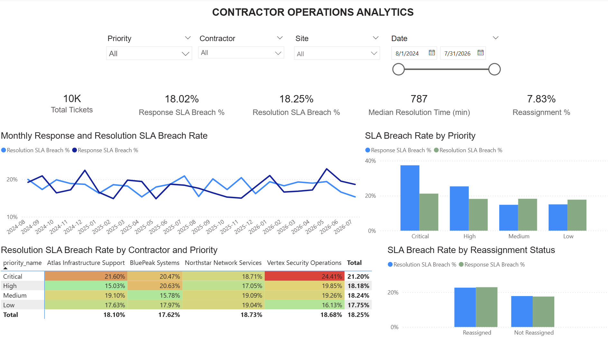
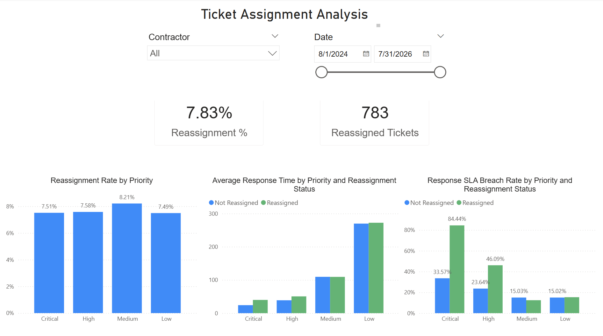

# Contractor Operations Analytics

End-to-end analytics project based on a real telecommunications contractor-management use case, rebuilt with synthetic data using **PostgreSQL, SQL, Python, and Power BI**.

The project analyzes contractor performance, operational incidents, SLA compliance, ticket assignments, recurring contractual tasks, and service-delivery performance.

> **Data note:** The business case is based on previous professional experience. All data used in this project is synthetic and contains no company or customer information.

---

## Business Problem

External contractors were responsible for different areas of the network infrastructure.

Each contractor worked under a contract that defined:

- Recurring operational tasks
- Service responsibilities
- SLA requirements
- Response and resolution targets

Contractor performance had to be reviewed regularly before invoice approval.

The process required analysis of ticket volumes, open and closed tickets, response and resolution times, SLA compliance, and contractor performance.

Previously, much of this analysis was performed manually in Excel, making the monthly reporting process time-consuming.

---

## Project Goal

The goal of this project is to build a centralized analytical solution for contractor operations and SLA monitoring.

The analysis focuses on:

- Contractor performance
- Ticket volume and status
- Response and resolution times
- SLA compliance and breaches
- Ticket reassignment
- Monthly performance trends
- Operational patterns affecting service performance

---

## Data

The analytical model includes information about:

- Contractors
- Contracts
- Tickets
- Priorities
- Sites and network assets
- SLA rules
- Ticket assignments
- Ticket events
- Recurring contractual tasks

The portfolio dataset contains **10,000 synthetic tickets across 24 months**.

---

## Analysis Workflow

**Synthetic Data → PostgreSQL → Data Quality Checks → SQL Analysis → Python Analysis → Power BI Dashboard**

### 1. PostgreSQL / SQL

- Relational data model
- Data validation and quality checks
- Data transformation
- KPI calculation
- Exploratory data analysis

### 2. Python / Pandas

- Distribution analysis
- Priority comparison
- Reassignment analysis
- Statistical testing

### 3. Power BI

- Contractor performance dashboard
- SLA monitoring
- Monthly trends
- Priority analysis
- Ticket assignment and reassignment analysis

---

## Key KPIs

- Total Tickets
- Open / Closed Tickets
- Response Time
- Resolution Time
- Response SLA Breach Rate
- Resolution SLA Breach Rate
- Reassignment Rate
- Contractor Performance

---

## Key Findings

- Critical tickets were resolved faster but showed higher response SLA breach rates because of stricter SLA targets.
- Reassigned Critical and High-priority tickets showed poorer response performance.
- Contractor performance varied by ticket priority.
- Higher monthly ticket volume was not clearly associated with higher resolution SLA breach rates.

---

## Business Value

The analysis supports:

- Contractor performance evaluation
- SLA monitoring
- Identification of operational issues
- Invoice validation
- Review of SLA-related penalties
- Contractor and contract-management decisions

---

## Tools

**PostgreSQL · SQL · Python · Pandas · Power BI · Git · GitHub**

---

## Power BI Dashboard

### Operations Overview

### Ticket Assignment Analysis

